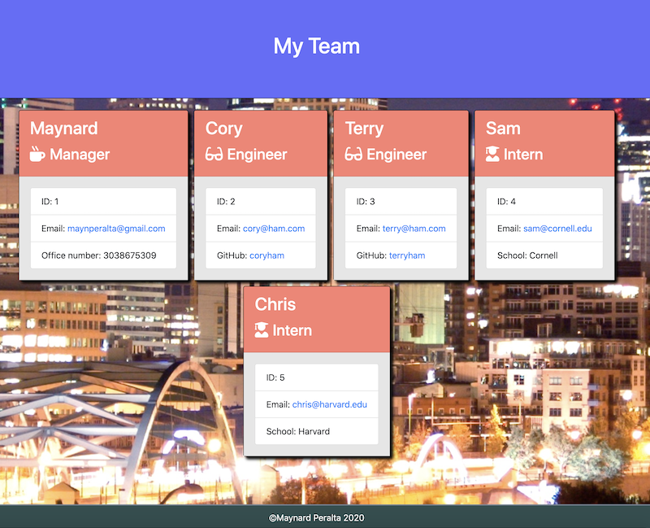
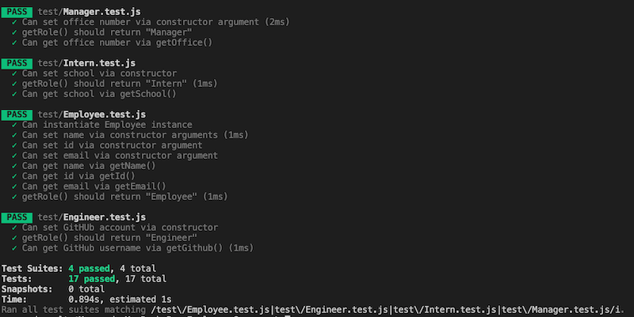

# Team Profile Generator
  

  ## Description
  This application uses a NodeJS CLI to generate an engineering team's employee information for quick reference.  
  
   

  ## Table of Contents
  [**Installation**](#installation) 
  [**Usage**](#usage) 
  [**License**](#license) 
  [**Technologies**](#technologies-used) 
  [**Contributing**](#contributing) 
  [**Tests**](#tests) 
  [**Questions**](#questions)
   

  ## Installation
  Open the employee-summary repository folder in VSCode along with an integrated terminal. Be sure the integrated terminal command path is the same as the repository folder (in this case "employee-summary"). On the terminal command line enter "node app.js" and enter the requested information. A link to a YouTube video demonstration is below. 
  
  
   

  ## Usage
  This project can be used in order to generate an html file which shows the employee information for a software engineering team's roster. The employee information includes name, role, email, and other information specific to the employee's role such as phone number, GitHub username, and school.
   

  ## License
  This project is licensed under MIT 
  License information can be found [here](https://opensource.org/licenses/MIT).
   

  ## Technologies Used
  * HTML
  * CSS
  * JavaScript
  * NodeJS
  * Bootstrap
  * Font Awesome

  ## Contributing
  Contributing persons should always get permission from the owner of the repository. Any contributors should also include their email and a link to thier personal GitHub profile in the "Questions" section below.
   

  ## Tests
  This application has passed all necessary tests. If a user would like to run the tests themselves, test files are included in the repository. To run the tests, open the repository in an integrated terminal (being sure the command path is the same as the folder name for the repo) and enter "npm run test" into the command line. 
  
   

  ## Questions
  If you have any questions regarding the project, feel free to reach out to the contributors below:  
  
  Maynard Peralta 
  <maynperalta@gmail.com>  
  [GitHub profile](https://github.com/maynperalta)